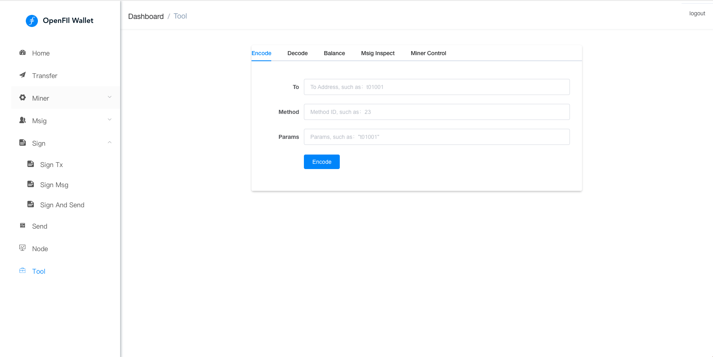

# tool

<figure><figcaption>
encode tool
</figcaption></figure>

<figure><figcaption>
decode
</figcaption></figure>

<figure><figcaption>
balance
</figcaption></figure>

<figure><figcaption>
msig inspect
</figcaption></figure>

<figure><figcaption>
miner control
</figcaption></figure>
